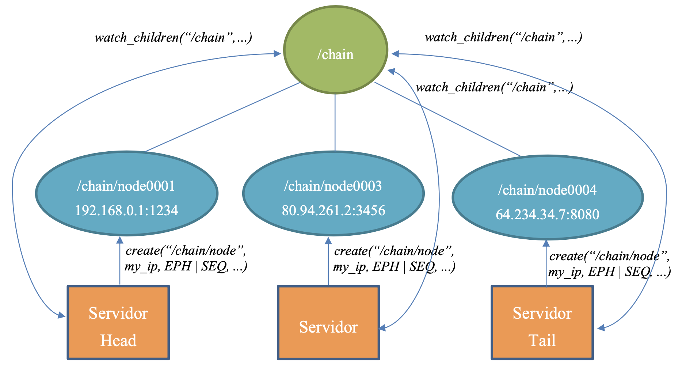

# DistributedSystems

This Project was made in my Bachelor Degree. The objective is to implement a distributed system in C language and using some external tools(ProtoBufers and Zookeper).

# 4 Project General Steps 

## Step 1

- In this step the objective is to implement a hash table where the keys are char* and data are LinkedLists of void*(arbitrary data).

## Step 2

- The goal of this step is to create the server and client side as well has the messages structures for comunication. At this point we only serialize data to procide wih the comunication. Were created in both sides a layer that take care of comunication and a layer that allows the comunication module interacts withe the hashtable. On the server side was created the main function and only accepts 1 request at a time.

## Step 3

- In this versions of the project we introduced the *poll()* system call for handling multiple connected clients at the same time. The system works with the main thread putting the requests (received by the *poll()*) in a Queue where the secondary thread will take the tasks and execut them. The tasks are only write tasks(put or delete). Each Write operation as an identifier that is a integer and is determinated by the variable *last_assign*. This identifier is sent to the client. Now the client can verify if the operation with that identifier is already executed or not. The read operatons are executed when are received in the server. Use of locks to control the acess to the Queue by the threads.

## Step 4

- In this step we introduced the Zookeeper. Zookeeper is a tool that can notify other entities (like clients or servers) that something in the distributed system has changed (some server died for example) and is responsible for the availability of all the servers. We change the server in order to be possible if a server dies, the system will adapt and will still be working properly. It was used *watch* to be possible to notify other servers that sometthing changed is the system. This version only supports loosing servers, not adding (except in the beginning were there are no data stored).

# Requirements

- Zookeeper installed and running;
- Installed Protocol Buffers compiler;

# Run

- create folders: lib/ object/ binary/
- run make
- run server and client
